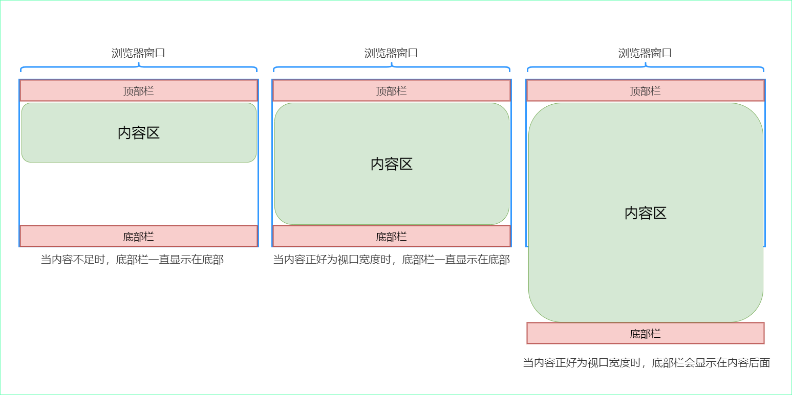

# 【不一样的CSS】实现Sticky Footer布局的 4 种方式

> **若彼岸繁华落尽，谁陪我看落日流年**


## 写在前面

对 CSS 布局掌握程度决定你在 Web 开发中的开发页面速度。随着 Web 技术的不断革新，实现各种布局的方式已经多得数不胜数了。

最近利用碎片时间，大概用了半个月的时间整理了一个系列，本系列文章总结了 CSS 中的各种布局，以及实现方式及其常用技巧。让你通过该系列文章对 CSS 布局有一个新的认识。

该系列的导航帖[点我进入](https://juejin.cn/post/6963251091035291656/)，里面可以快速跳转到你想了解的文章(建议收藏)

### Sticky Footer布局概述

所谓的 Sticky Footer 布局并不是一种新的前端技术和概念，它就是一种网页布局。如果页面内容不够长时，底部栏就会固定到浏览器的底部；如果足够长时，底部栏就后跟随在内容的后面。如下图所示：



## 实现Sticky Footer布局的 4 种方式

在开始今天的文章之前，我们先把今天的主要代码放到下面：

公共的 CSS 样式如下：

```css
body {
    margin: 0;
}
.container {
    height: 400px;
    display: flex;
}
.left {
    height: 400px;
    width: 200px;
    background-color: #f759ab;
}
.content {
    height: 400px;
    background-color: #52c41a;
    flex: 1;
}
.right {
    height: 400px;
    width: 200px;
    background-color: #f759ab;
}
.left,
.content,
.right {
    font-size: 70px;
    line-height: 400px;
    text-align: center;
}
.header {
    height: 100px;
    background-color: #70a1ff;
}
.footer {
    height: 100px;
    background-color: #ff7a45;
}
.header,
.footer {
    line-height: 100px;
    font-size: 52px;
    text-align: center;
}
```

HTML 结构如下：

```html
<div class="main">
    <div class="header">header</div>
    <div class="container">
        <div class="left">left</div>
        <div class="content">content</div>
        <div class="right">right</div>
    </div>
    <div class="footer">footer</div>
</div>
```

### 绝对定位的方式实现

由于我们三列布局中已经介绍过中间部分的实现，这里就不介绍了，如果想看中间部分是怎么实现的，可以去[]()查看。

实现 Sticky Footer 布局的步骤如下：

1. 设置最外层容器高度为100%
2. 让子元素元素相对于容器元素进行定位，并设置容器元素最小高度为100%
3. 在中间区域设置 padding-bottom 为 footer 的高度 
4. 底部栏绝对定位，并一直吸附在底部即可实现

CSS 代码如下如下：

```css
/* 1. 设置最外层容器为100% */
html,
body {
    height: 100%;
}
/* 2. 让子元素元素相对于容器元素进行定位，并设置容器元素最小高度为100% */
.main {
    position: relative;
    min-height: 100%;
}
/* 3. 在中间区域设置 padding-bottom 为footer 的高度 */
.container {
    padding-bottom: 100px;
}
/* 由于开启了绝对定位，宽度成了自适应，设置为100% bottom:0 始终保持底部 */
.footer {
    position: absolute;
    width: 100%;
    bottom: 0;
}
```

### 使用 calc 函数实现

使用 calc 函数实现的方式会比较简单，中间的容器最少高度为视口宽度的 100% - 头部和底部两部分的高度 即可完成该功能，示例代码如下：

```css
.container {
    /* 这里的 中间 部分的容器最少为视口宽度的 100% - 头部和底部两部分的高度即可完成该功能 */
    min-height: calc(100vh - 200px);
}
```

### 使用 flex 布局实现

实现步骤如下

1. 开启 flex 布局
2. 将子元素布局方向修改为垂直排列
3. 设置最小高度为当前视口，使不管中间部分有多高，始终都可以保持在底部
4. 设置中间部分容器高度为自适应

CSS 代码如下：

```css
.main {
    /* 开启flex布局 */
    display: flex;
    /* 将子元素布局方向修改为垂直排列 */
    flex-flow: column;
    /* 设置最小高度为当前视口，使不管中间部分有多高，始终都可以保持在底部 */
    min-height: 100vh;
}
.container {
    /* 设置 中间 部分自适应 */
    flex: 1;
}
```

> 关于 Flex 布局的详细用法请参考 [点我进入](https://juejin.cn/post/6963250638214365220)


### 使用 grid 布局

实现步骤如下

1. 开启grid布局
2. 置最小高度为当前视口，使不管中间部分有多高，始终都可以保持在底部

CSS 代码如下：

```css
.main {
    /* 开启grid布局 */
    display: grid;
    grid-template-rows: auto 1fr auto;
    /* 设置最小高度为当前视口，使不管中间部分有多高，始终都可以保持在底部 */
    min-height: 100vh;
}
```


> 关于 Grid 布局的详细用法请参考 [点我进入](https://juejin.cn/post/6963252773202690055)


## 总结

