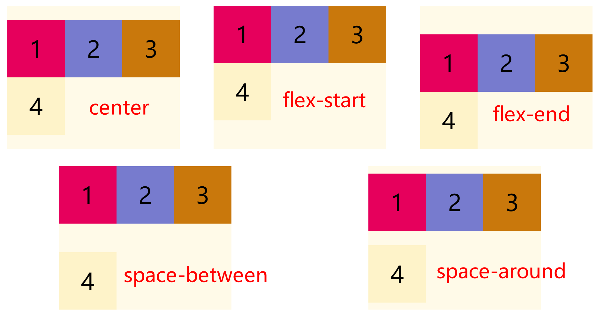

# 【不一样的CSS】一文掌握 Grid 布局(长篇警告)

> **若彼岸繁华落尽，谁陪我看落日流年**

[toc]

## 写在前面

对 CSS 布局掌握程度决定你在 Web 开发中的开发页面速度。随着 Web 技术的不断革新，实现各种布局的方式已经多得数不胜数了。

最近利用碎片时间，大概用了半个月的时间整理了一个系列，本系列文章总结了 CSS 中的各种布局，以及实现方式及其常用技巧。让你通过该系列文章对 CSS 布局有一个新的认识。

该系列的导航帖[点我进入](https://juejin.cn/post/6963251091035291656/)，里面可以快速跳转到你想了解的文章(建议收藏)

### 文章概述

由于篇幅较长(请谨慎阅读)，下图涵盖了本篇文章的主要知识点


正文开始

### 弹性盒子模型是什么

CSS3新增了弹性盒子模型( *Flexible Box*或*FlexBox*)，是一种新的用于在HTML页面实现布局的方式。使得当HTML页面适应不同尺寸的屏幕和不同的设备时，元素是可预测地运行。

弹性盒子模型实现HTML页面布局是与方向无关的。不类似于块级布局侧重垂直方向，内联布局侧重水平方向。

弹性盒子模型主要**适用于HTML页面的组件以及小规模的布局**，而并**不适用于大规模的布局**，**否则会影响 HTML 页面性能**。

### 弹性盒子模型相关概念

CSS3新增的弹性盒子模型是一个完整的模块，涉及的样式属性较多。首先，对弹性盒子模型的相关概念完成基本的了解。


- 伸缩容器(*flex container*) :包裹伸缩项目的父元素。
- 伸缩项目(*flex item*) :伸缩容器的每个子元素。
- 轴(*axis*) :每个弹性盒子模型拥有两个轴。
  - 主轴(*main axis*) :伸缩项目沿其一次排列的轴被称为主轴。
  - 侧轴(*cross axis*) :垂直于主轴的轴被称为侧轴。
  - 方向(*direction*) :伸缩容器的主轴由主轴起点和主轴终点，侧轴由侧轴起点和侧轴终点描述伸缩项目排列的方向。
- 尺寸(*dimension*) :根据伸缩容器的主轴和侧轴，伸缩项目的宽度和高度。
  - 对应主轴的称为主轴尺寸。
  - 对应侧轴的称为侧轴尺寸。

### 定义弹性盒子模型

CSS3中想要设置为弹性盒子模型的话，需要通过 `display` 样式属性设置值为 `flex` 或 `inline-flex` 即可。

```css
display: fiex; /* 值 flex 使弹性容器成为块级元素。 */
/* 或者 */
display: inline-fiex; /* 值 inline-flex 使弹性容器成为单个不可分的行内级元素。 */
```

> 以上代码就可以指定某个元素为弹性盒子模型，该元素成为伸缩容器，子元素则成为伸缩项目。
>

弹性盒子模型也存在浏览器兼容问题，解决方案如下：

```css
/* WebKit引擎的浏览器(Chrome, Safari, Opera) */
display: -webkit-fiex;
/* Trident引擎的浏览器(IE 10+) */
dispaly: -ms-fiex;
/* Gecko引擎的浏览器(Firefox) */
display: -moz-fiex;
/* Presto引擎的浏览器(Opera) */
dispaly: -o-fiex;
```

示例代码如下：定义一个简单的 Flex Box

```html
<!DOCTYPE html>
<html lang="en">
    <head>
        <meta charset="UTF-8" />
        <meta name="viewport" content="width=device-width, initial-scale=1.0" />
        <title>定义弹性盒子模型</title>
        <link rel="stylesheet" href="./init.css" />
        <style>
            /* 
                将父级元素设置为弹性盒子模型
                * 这样设置的话子级所有元素都为弹性盒子模型
                * 默认情况下，所有子元素作为伸缩项目都是沿着主轴水平排列
            */
            .container {
                display: flex;
            }
        </style>
    </head>

    <body>
        <!-- HTML 结构为父子级结构 -->
        <div class="container">
            <div class="item1 item">1</div>
            <div class="item2 item">2</div>
            <div class="item3 item">3</div>
        </div>
    </body>
</html>

```

> 这里并没有开启浮动之类的关于布局的样式，仅仅将 `.container` 的 `display` 设置为 `flex`

执行结果如下所示；


>   默认情况下，所有子元素作为伸缩项目都是沿着主轴水平排列


## 伸缩容器的属性

### flex-direction 属性

CSS `flex-direction` 属性指定了内部元素是如何在 flex 容器中布局的，定义了主轴的方向(正方向或反方向)。

语法结构

```css
flex-direction: row | row-reverse | column | column-reverse;
```

值

- `row`： 默认值，`flex` 容器的主轴被定义为与文本方向相同。 主轴起点和主轴终点与内容方向相同(起点在左端)。

- `row-reverse`： 表现和 `row` 相同，但是置换了主轴起点和主轴终点(起点在右端)

- `column`： `flex` 容器的主轴和块轴相同。主轴起点与主轴终点和书写模式的前后点相同(起点在上沿)

- `column-reverse`： 表现和 `column` 相同，但是置换了主轴起点和主轴终点明(起点在下沿)

```html
<!DOCTYPE html>
<html lang="en">
    <head>
        <meta charset="UTF-8" />
        <meta http-equiv="X-UA-Compatible" content="IE=edge" />
        <meta name="viewport" content="width=device-width, initial-scale=1.0" />
        <title>02 flex-direction属性</title>
        <link rel="stylesheet" href="./init.css" />
        <style>
            body {
                display: flex;
            }
            .container {
                display: flex;
                margin: 20px;
            }
            /* 
                flex-direction 属性
                * 作用：创建主轴方向
                * 适用于伸缩容器元素
                * 值
                    * row: 设置主轴是水平方向 默认
                    * row-reverse: 与 row 的方向相反
                    * column：设置主轴的方向是垂直方向
                    * column-reverse: 与column 方向相反
            */
            .row {
                /* 默认，水平排列 */
                flex-direction: row;
                height: 200px;
            }
            .row-reverse {
                /* 水平排列，反向 */
                flex-direction: row-reverse;
                height: 200px;
            }
            .column {
                /* 垂直排列 */
                flex-direction: column;
            }
            .column-reverse {
                /* 垂直排列 反向 */
                flex-direction: column-reverse;
            }
        </style>
    </head>
    <body>
        <div class="container row">
            <div class="item1 item">1</div>
            <div class="item2 item">2</div>
            <div class="item3 item">3</div>
        </div>
        <div class="container row-reverse">
            <div class="item1 item">1</div>
            <div class="item2 item">2</div>
            <div class="item3 item">3</div>
        </div>
        <div class="container column">
            <div class="item1 item">1</div>
            <div class="item2 item">2</div>
            <div class="item3 item">3</div>
        </div>
        <div class="container column-reverse">
            <div class="item1 item">1</div>
            <div class="item2 item">2</div>
            <div class="item3 item">3</div>
        </div>
    </body>
</html>

```

执行效果如下


### justify-content 属性

CSS `justify-content` 属性适用于伸缩容器元素，用于设置伸缩项目沿着**主轴线的对齐方式**。

语法结构

```css
justify-content: center| flex-start| flex-end| space-between| space-around;
```

值

- `center`: 伸缩项目向第一行的中间位置对齐(居中)。
- `flex-start`: 伸缩项目向第一行的开始位置对齐(左对齐)。
- `flex-end`: 伸缩项目向第一行的结束位置对齐(右对齐)。
- `space-between`: 伸缩项目会平均分布在一行中(两端对齐，项目之间的间隔都相等)。
- `space-around`: 伸缩项目会平均分布在一行中(两端对齐，项目两侧的间隔相等)。 

示例代码

```html
<!DOCTYPE html>
<html lang="en">
    <head>
        <meta charset="UTF-8" />
        <meta http-equiv="X-UA-Compatible" content="IE=edge" />
        <meta name="viewport" content="width=device-width, initial-scale=1.0" />
        <title>justify-content 属性</title>
        <link rel="stylesheet" href="./init.css" />
        <style>
            .container {
                display: flex;
                width: 1080px;
                margin: 100px auto 0;
            }
            .item {
                height: 100px;
                width: 240px;
                line-height: 100px;
            }
            /* 
            justify-content属性
            * 作用：设置伸缩项目沿着主轴线的对齐方式
              * 值
                - center: 伸缩项目向第一行的中间位置对齐(居中)。
                - flex-start: 伸缩项目向第一行的开始位置对齐(左对齐)。
                - flex-end: 伸缩项目向第一行的结束位置对齐(右对齐)。
                - space-between: 伸缩项目会平均分布在一行中(两端对齐，项目之间的间隔都相等)。
                - space-around: 伸缩项目会平均分布在一行中(两端对齐，项目两侧的间隔相等)。 
            */
            .center {
                justify-content: center; /* 居中 */
            }
            .start {
                justify-content: flex-start; /* 左对齐 */
            }
            .end {
                justify-content: flex-end; /* 右对齐 */
            }
            .between {
                justify-content: space-between; /* 两端对齐，项目之间的间隔都相等 */
            }
            .around {
                justify-content: space-around; /* 两端对齐，项目两侧的间隔相等 */
            }
        </style>
    </head>
    <body>
        <div class="container center">
            <div class="item1 item">1</div>
            <div class="item2 item">2</div>
            <div class="item3 item">3</div>
        </div>
        <div class="container start">
            <div class="item1 item">1</div>
            <div class="item2 item">2</div>
            <div class="item3 item">3</div>
        </div>
        <div class="container end">
            <div class="item1 item">1</div>
            <div class="item2 item">2</div>
            <div class="item3 item">3</div>
        </div>
        <div class="container between">
            <div class="item1 item">1</div>
            <div class="item2 item">2</div>
            <div class="item3 item">3</div>
        </div>
        <div class="container around">
            <div class="item1 item">1</div>
            <div class="item2 item">2</div>
            <div class="item3 item">3</div>
        </div>
    </body>
</html>

```

执行效果如下


> **值得注意的是** 实现的是伸缩项目相对于伸缩容器的对齐方式，与页面无关

### align-items 属性

CSS `align-items` 属性适用于伸缩容器元素，用于设置伸缩项目所在行沿着**侧轴线的对齐方式**。

语法结构

```css
align-items: center | flex-start| flex-end| baseline| stretch;
```

值

- `center`: 伸缩项目向侧轴的中间位置对齐。
- `flex-start`: 伸缩项目向侧轴的起点位置对齐。
- `flex-end`: 伸缩项目向侧轴的终点位置对齐。
- `baseline`: 伸缩项目根据伸缩项目的基线对齐。
- `stretch`: 默认值，伸缩项目拉伸填充整个伸缩容器。

```html
<!DOCTYPE html>
<html lang="en">
    <head>
        <meta charset="UTF-8" />
        <meta http-equiv="X-UA-Compatible" content="IE=edge" />
        <meta name="viewport" content="width=device-width, initial-scale=1.0" />
        <title>align-items 属性</title>
        <link rel="stylesheet" href="./init.css" />
        <style>
            body {
                display: flex;
            }
            .container {
                display: flex;
                width: 600px;
                height: 500px;
            }
            /* 
              align-items属性
              * 作用：设置伸缩项目所在行沿着侧轴线的对齐方式
                * 值
                  - center: 伸缩项目向侧轴的中间位置对齐。
                  - flex-start: 伸缩项目向侧轴的起点位置对齐。
                  - flex-end: 伸缩项目向侧轴的终点位置对齐。
                  - baseline: 伸缩项目根据伸缩项目的基线对齐。
                  - stretch: 默认值，伸缩项目拉伸填充整个伸缩容器。
            */
            .center {
                align-items: center; /* 居中 */
            }
            .start {
                align-items: flex-start; /* 顶对齐 */
            }
            .end {
                align-items: flex-end; /* 底对齐 */
            }
        </style>
    </head>
    <body>
        <div class="container center">
            <div class="item1 item">1</div>
            <div class="item2 item">2</div>
            <div class="item3 item">3</div>
        </div>
        <div class="container start">
            <div class="item1 item">1</div>
            <div class="item2 item">2</div>
            <div class="item3 item">3</div>
        </div>
        <div class="container end">
            <div class="item1 item">1</div>
            <div class="item2 item">2</div>
            <div class="item3 item">3</div>
        </div>
    </body>
</html>

```

执行效果如下


> 配合 `justify-content` 属性，可以做出水平垂直居中

### flex-wrap 属性

CSS `flex-wrap` 属性适用于伸缩容器元素，用于**设置**伸缩容器的**子元素是单行显示还是多行显示**。

语法结构

```css
flex-wrap: nowrap| wrap| wrap-reverse
```

值

- `nowrap`: 设置伸缩项目单行显示。这种方式可能导致溢出伸缩容器
- `wrap`: 设置伸缩项目多行显示，第一行在上方。
- `wrap-reverse`: 与 `wrap` 相反，第一行在下方。

```html
<!DOCTYPE html>
<html lang="en">
    <head>
        <meta charset="UTF-8" />
        <meta http-equiv="X-UA-Compatible" content="IE=edge" />
        <meta name="viewport" content="width=device-width, initial-scale=1.0" />
        <title>flex-wrap 属性</title>
        <link rel="stylesheet" href="./init.css" />
        <style>
            body {
                display: flex;
            }
            .container {
                display: flex;
                width: 600px;
                height: 400px;
            }
            .item {
                width: 200px;
            }
            /* 
              flex-wrap属性
              * 作用：设置伸缩容器的子元素是单行显示还是多行显示。
              * 值
               - nowrap: 设置伸缩项目单行显示。这种方式可能导致溢出伸缩容器
               - wrap: 设置伸缩项目多行显示，第一行在上方。
               - wrap-reverse: 与 `wrap` 相反，第一行在下方。
            */
            .nowrap {
                flex-wrap: nowrap;
            }
            .wrap {
                flex-wrap: wrap;
            }
            .wrap-reverse {
                flex-wrap: wrap-reverse;
            }
        </style>
    </head>
    <body>
        <div class="container nowrap">
            <div class="item1 item">1</div>
            <div class="item2 item">2</div>
            <div class="item3 item">3</div>
            <div class="item4 item">4</div>
        </div>
        <div class="container wrap">
            <div class="item1 item">1</div>
            <div class="item2 item">2</div>
            <div class="item3 item">3</div>
            <div class="item4 item">4</div>
        </div>
        <div class="container wrap-reverse">
            <div class="item1 item">1</div>
            <div class="item2 item">2</div>
            <div class="item3 item">3</div>
            <div class="item4 item">4</div>
        </div>
    </body>
</html>

```

执行效果如下


> 如果设置伸缩容器的宽度小于所有子元素宽度之和的话，子元素并没有自动换行也没有溢出。
>
> 效果根据伸缩容器的宽度自动调整所有子元素的宽度

### align-content 属性

CSS `align-content` 属性适用于伸缩容器元素，用于设置**伸缩行**的对齐方式。该属性会更改 `flex-wrap` 属性的效果。

**该属性对单行弹性盒子模型无效。**

语法结构

```css
align-content: center| flex-start| flex-end| space-between| space-around| stretch;
```

值

- `center`: 各行向伸缩容器的中间位置对齐。
- `flex-start`: 各行向伸缩容器的起点位置对齐。
- `flex-end`: 各行向伸缩容器的终点位置对齐。
- `space-between`: 各行会平均分布在一行中。
- `space-around`: 各行会平均分布在一行中， 两端保留一半的空间。
- `stretch`: 默认值，各行将会伸展以占用额外的空间。

示例代码如下所示：

```html
<!DOCTYPE html>
<html lang="en">
    <head>
        <meta charset="UTF-8" />
        <meta http-equiv="X-UA-Compatible" content="IE=edge" />
        <meta name="viewport" content="width=device-width, initial-scale=1.0" />
        <title>align-content 属性</title>
        <link rel="stylesheet" href="./init.css" />
        <style>
            body {
                display: flex;
                flex-wrap: wrap;
            }
            .container {
                display: flex;
                width: 600px;
                height: 500px;
                flex-wrap: wrap;
            }
            .item {
                width: 200px;
            }
            /* 
            align-content属性
            * 作用：设置设置伸缩行的对齐方式
              * 值
                - center: 各行向伸缩容器的中间位置对齐(居中)。
                - flex-start: 各行向伸缩容器的起点位置对齐(顶对齐)。
                - flex-end: 各行向伸缩容器的终点位置对齐(底对齐)。
                - space-between: 各行会平均分布在一行中(两端对齐，项目之间的间隔都相等)。
                - space-around: 各行会平均分布在一行中， 两端保留-半的空间(两端对齐，项目两侧的间隔相等)。
                - stretch: 默认值，各行将会伸展以占用额外的空间。
            * 注意：该属性对单行无效，即：带有 flex-wrap: nowrap
            */
            .center {
                align-content: center; /* 居中 */
            }
            .start {
                align-content: flex-start; /* 顶对齐 */
            }
            .end {
                align-content: flex-end; /* 底对齐 */
            }
            .between {
                align-content: space-between; /* 两端对齐，项目之间的间隔都相等 */
            }
            .around {
                align-content: space-around; /* 两端对齐，项目两侧的间隔相等 */
            }
        </style>
    </head>
    <body>
        <div class="container center">
            <div class="item1 item">1</div>
            <div class="item2 item">2</div>
            <div class="item3 item">3</div>
            <div class="item4 item">4</div>
        </div>
        <div class="container start">
            <div class="item1 item">1</div>
            <div class="item2 item">2</div>
            <div class="item3 item">3</div>
            <div class="item4 item">4</div>
        </div>
        <div class="container end">
            <div class="item1 item">1</div>
            <div class="item2 item">2</div>
            <div class="item3 item">3</div>
            <div class="item4 item">4</div>
        </div>
        <div class="container between">
            <div class="item1 item">1</div>
            <div class="item2 item">2</div>
            <div class="item3 item">3</div>
            <div class="item4 item">4</div>
        </div>
        <div class="container around">
            <div class="item1 item">1</div>
            <div class="item2 item">2</div>
            <div class="item3 item">3</div>
            <div class="item4 item">4</div>
        </div>
    </body>
</html>

```

执行效果如下



> **值得注意的是**该属性对单行弹性盒子模型无效，即：带有 `flex-wrap: nowrap`

### flex-flow 属性

CSS `flex-flow` 属性适用于伸缩容器元素，该属性是 `flex-direction` 和 `flex-wrap` 的简写属性，默认值为 `row nowrap`。

语法结构

```css
flex-flow: <'flex-direction'> || <'flex-wrap'>
```

## 伸缩项的属性

### order 属性

CSS `order` 属性规定了弹性容器中的可伸缩项目在布局时的顺序。元素按照 `order` 属性的值的增序进行布局。拥有相同 `order` 属性值的元素按照它们在源代码中出现的顺序进行布局。

语法结构

```css
.item {
  order: <integer>
}
```

**属性值**

- `<integer>`: 表示此可伸缩项目所在的次序组, 默认为0。

> **注意**: `order` 仅仅对元素的视觉顺序产生作用，并不会影响元素的逻辑顺序。

示例代码

```html
<!DOCTYPE html>
<html lang="en">
    <head>
        <meta charset="UTF-8" />
        <meta http-equiv="X-UA-Compatible" content="IE=edge" />
        <meta name="viewport" content="width=device-width, initial-scale=1.0" />
        <title>order 属性</title>
        <link rel="stylesheet" href="./init.css" />
        <style>
            body {
                display: flex;
                flex-wrap: wrap;
            }
            .container {
                display: flex;
                width: 800px;
                height: 300px;
                align-items: center;
            }
            .item { width: 200px;}
            /* 
              order属性定义项目的排列顺序。数值越小，排列越靠前，默认为0。
            */
            .item1 { order: 2; }
            .item4 { order: -1;}
        </style>
    </head>
    <body>
        <div class="container">
            <div class="item1 item">1</div>
            <div class="item2 item">2</div>
            <div class="item3 item">3</div>
            <div class="item4 item">4</div>
        </div>
    </body>
</html>

```

执行效果如下


> 使用这个属性可以非常简单的改变其布局

### flex-grow 属性

`flex-grow` 属性规定在相同的容器中，项目相对于其余弹性项目的增长量，值默认为0

语法结构如下：

```css
.item {
  flex-grow: <number>; 
}
```

示例代码如下

```html
<!DOCTYPE html>
<html lang="en">
    <head>
        <meta charset="UTF-8" />
        <meta http-equiv="X-UA-Compatible" content="IE=edge" />
        <meta name="viewport" content="width=device-width, initial-scale=1.0" />
        <title>flex-grow 属性</title>
        <link rel="stylesheet" href="./init.css" />
        <style>
            body {
                display: flex;
                flex-wrap: wrap;
            }
            .container {
                display: flex;
                width: 800px;
                height: 300px;
                align-items: center;
            }
            .item {
                width: 200px;
            }
            /* 
              flex-grow 属性规定在相同的容器中，项目相对于其余弹性项目的增长量，值默认为0
            */
            .item2 {
                flex-grow: 2;
            }
        </style>
    </head>
    <body>
        <div class="container">
            <div class="item1 item">1</div>
            <div class="item2 item">2</div>
            <div class="item1 item">1</div>
        </div>
    </body>
</html>

```

执行效果如下


> 如果所有伸缩项目的 `flex-grow` 的值都为1，则它们将等分剩余空间
>
> 如果某个伸缩项目的 `flex-grow` 的值为2，其他为1，则前者占据的剩余空间将比其他项多一倍。

### flex-shrink 属性

`flex-shrink` 属性定义了项目的缩小比例，默认为1，即如果空间不足，该项目将缩小。

语法结构如下：

```css
.item {
  flex-shrink: <number>; 
}
```

示例代码如下

```html
<!DOCTYPE html>
<html lang="en">
    <head>
        <meta charset="UTF-8" />
        <meta http-equiv="X-UA-Compatible" content="IE=edge" />
        <meta name="viewport" content="width=device-width, initial-scale=1.0" />
        <title>flex-shrink 属性</title>
        <link rel="stylesheet" href="./init.css" />
        <style>
            body {
                display: flex;
                flex-wrap: wrap;
            }
            .container {
                display: flex;
                width: 500px;
                height: 300px;
                align-items: center;
            }
            .item {
                width: 200px;
            }
            /* 
              flex-shrink 属性定义了项目的缩小比例，默认为1，即如果空间不足，该项目将缩小。
            */
            .item2 {
                flex-shrink: 2;
            }
        </style>
    </head>
    <body>
        <div class="container">
            <div class="item1 item">1</div>
            <div class="item2 item">2</div>
            <div class="item1 item">1</div>
        </div>
    </body>
</html>

```

执行效果如下


> 如果所有伸缩项目的 `flex-shrink` 的值都为1，当空间不足时，都将等比例缩小
>
> 如果某个伸缩项目的 `flex-shrink` 的值为0，其他为1，则空间不足时，前者不缩小。

### flex-basis 属性

`flex-basis` 属性定义了在分配多余空间之前，项目在主轴方向上的初始大小。浏览器根据这个属性，计算主轴是否有多余空间。它的默认值为`auto`，即项目的本来大小。

语法结构如下：

```css
.item {
  flex-basis: <length> | auto; 
}
```

> 它可以设为跟 `width` 或 `height` 属性一样的值，例如设置 `230px`，则项目将占据固定空间。

### flex 属性

CSS `flex` 属性是 `flex-grow` 、flex-shrink 、`flex-basis` 的简写属性，用于设置伸缩项目如何伸长或缩短以适应伸缩容器中的可用空间。

语法结构

```css
flex: auto | initial | none | [ <'flex-grow'> <'flex-shrink'>? || <'flex-basis'> ]
```

- `none`: 元素会根据自身宽高来设置尺寸。它是完全非弹性的：既不会缩短，也不会伸长来适应 flex 容器。相当于将属性设置为"`flex: 0 0 auto`"。
- `auto`: 元素会根据自身的宽度与高度来确定尺寸，但是会伸长并吸收 flex 容器中额外的自由空间，也会缩短自身来适应 flex 容器。这相当于将属性设置为 "`flex: 1 1 auto`".

`flex` 属性可以指定1个、2个或3个值。

**单值语法**: 值必须为以下其中之一:

- 一个无单位数(`<number>`): 它会被当作 `<flex-grow>` 的值。
- 一个有效的宽度(width)值: 它会被当作 `<flex-basis>`的值。
- 关键字`none`，`auto`或`initial`.

**双值语法**: 第一个值必须为一个无单位数，并且它会被当作 `<flex-grow>` 的值。第二个值必须为以下之一：

- 一个无单位数：它会被当作 `<flex-shrink>` 的值。
- 一个有效的宽度值: 它会被当作 `<flex-basis>` 的值。

**三值语法**:

- 第一个值必须为一个无单位数，并且它会被当作 `<flex-grow>` 的值。
- 第二个值必须为一个无单位数，并且它会被当作  `<flex-shrink>` 的值。
- 第三个值必须为一个有效的宽度值， 并且它会被当作 `<flex-basis>` 的值。

### align-self 属性

CSS `align-self` 属性适用于伸缩容器元素,于设置伸缩项目自身元素在侧轴的对齐方式。该属性可覆盖 `align-items` 属性。默认值为 `auto`，表示继承父元素的 `align-items` 属性

语法结构

```css
align-self: center| flex-start| flex-end| baseline| stretch;
```

- `center`: 伸缩项目向侧轴的中间位置对齐。
- `flex-start`: 伸缩项目向侧轴的起点位置对齐。
- `flex-end`: 伸缩项目向侧轴的终点位置对齐。
- `baseline`: 伸缩项目根据伸缩项目的基线对齐。
- `stretch`: 默认值，伸缩项目拉伸填充整个伸缩容器。

示例代码

```html
<!DOCTYPE html>
<html lang="en">
    <head>
        <meta charset="UTF-8" />
        <meta http-equiv="X-UA-Compatible" content="IE=edge" />
        <meta name="viewport" content="width=device-width, initial-scale=1.0" />
        <title>align-self 属性</title>
        <link rel="stylesheet" href="./init.css" />
        <style>
            body {
                display: flex;
                flex-wrap: wrap;
            }
            .container {
                display: flex;
                width: 600px;
                height: 400px;
                align-items: center;
            }
            .item {
                width: 200px;
            }
            /* 
              align-self 属性 设置单个元素的对齐方式
            */
            .start {
                align-self: flex-start;
            }
            .center {
                align-self: center;
            }
            .end {
                align-self: flex-end;
            }
        </style>
    </head>
    <body>
        <div class="container">
            <div class="item1 item start">1</div>
            <div class="item2 item center">2</div>
            <div class="item3 item end">3</div>
        </div>
    </body>
</html>

```

执行效果如下


(完)

>  PS: 关于 Flex 布局有一个小游戏可以帮助我们练习 [Flexbox Froggy - 一个用来学CSS flexbox的游戏](https://flexboxfroggy.com/#zh-cn)

## 用到的 CSS 样式

```css
body {
    margin: 0;
    padding: 20px;
}
.container {
    background-color: #fffae8;
    margin: 30px auto;
}
.item {
    height: 200px;
    width: 200px;
    line-height: 200px;
    text-align: center;
    font-size: 80px;
}
.item1 {
    background-color: #e6005c;
}
.item2 {
    background-color: #777bce;
}
.item3 {
    background-color: #c9780c;
}
.item4 {
    background-color: #fef3c9;
}
.item5 {
    background-color: #ce3b3b;
}
.item6 {
    background-color: #e666ff;
}
.item7 {
    background-color: #f4ea20;
}
.item8 {
    background-color: #b4a4ca;
}

```

