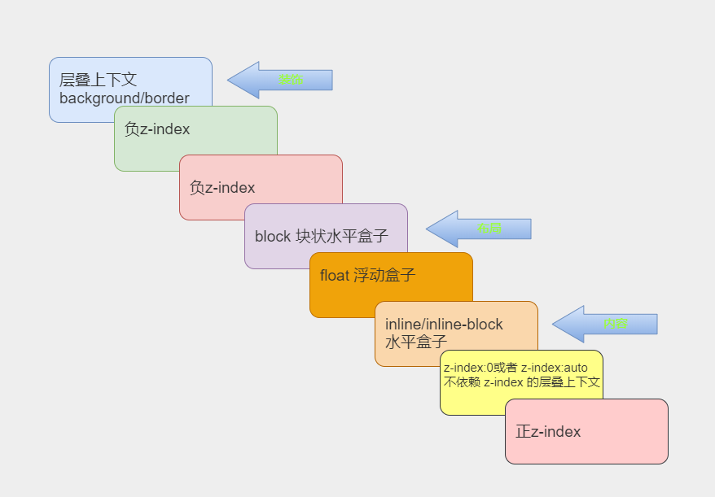

# 【不一样的CSS】深入理解 z-index （我们一起来叠罗汉)

[toc]

## 写在前面

对 CSS 布局掌握程度决定你在 Web 开发中的开发页面速度。随着 Web 技术的不断革新，实现各种布局的方式已经多得数不胜数了。

最近利用碎片时间，大概用了半个月的时间整理了一个系列，本系列文章总结了 CSS 中的各种布局，以及实现方式及其常用技巧。让你通过该系列文章对 CSS 布局有一个新的认识。

该系列的导航帖[点我进入](https://juejin.cn/post/6963251091035291656/)，里面可以快速跳转到你想了解的文章(建议收藏)


### `z-index` 含义

`z-index` 属性制定了元素及其子元素的 **在 Z 轴上面的顺序**，而 **Z 轴上面的顺序** 可以决定当元素发生覆盖的时候，那个元素在上面。通常一个较大的 `z-index` 值得元素会覆盖较低的哪一个。

### `z-index` 语法结构

`z-index` 语法结构如下

```css
.tontainer {
  z-index: auto | <integer> ;
}
```

**属性值**

- `auto`: 默认值，当前值与父级相同
- `<integer>`: 整型数字

### 基本特性

`z-index` 属性的基本特性如下几点：

1. `z-index` 属性是允许给一个负值得。
2. `z-index` 属性支持 CSS3 `animation` 动画。
3. 在 CSS 2.1 的时候，需要配合 `position` 属性且值不为 `static` 时使用。

## z-index 与 CSS 定位属性

`z-index` 属性只能配合开启定位元素的元素中使用(CSS3 中除外) 其计算规则如下：

### **如果定位元素 `z-index` 没有发生嵌套**

则渲染表现如下：

- 一般来讲，当 CSS 样式没有太大差别的时候，哪个元素在后面哪个元素就在上面。

  示例代码如下：

  HTML 结构

  ```html
  <body>
      <div class="container">
          <div class="item item1">1</div>
          <div class="item item2">2</div>
      </div>
  </body>
  ```

  CSS 代码

  ```css
  .container {
      position: relative;
  }
  .item {
      position: absolute;
  }
  .item2 {
      left: 120px;
  }
  ```

  执行结果如下：

  

- 如果该元素设置了 `z-index` 值，哪个元素的 `z-index` 的值大，哪个元素就在上面。

  示例代码如下：

  HTML结构如上

  CSS代码

  ```css
  .container {
      position: relative;
  }
  .item {
      position: absolute;
  }
  .item1 {
      z-index: 2;
  }
  .item2 {
      left: 120px;
      z-index: 1;
  }
  ```

  执行结果如下：

  

### **如果定位元素 `z-index` 发生嵌套**

则渲染表现如下：

- 根据祖先的 `z-index` 值来决定谁在上面，如果祖先本身的 `z-index` 的值没有其他元素祖先本身的 `z-index` 值大，子元素 `z-index` 的值就算再大也没有作用。

  示例代码如下：

  HTML 结构

  ```html
  <body>
      <div class="container container1">
          <div class="item item1">1</div>
      </div>
      <div class="container container2">
          <div class="item item2">2</div>
      </div>
  </body>
  ```

  CSS 代码

  ```css
  .container { position: absolute; }
  .container1 { z-index: 1; }
  .container2 { z-index: 2; left: 120px; }
  .item { position: relative; }
  .item1 { z-index: 999; }
  .item2 { z-index: 1; }
  ```

  执行结果如下：

  

##  CSS 中 层叠上下文 和 层叠水平

### 层叠上下文

**层叠上下文**是 HTML 元素中的一个三维概念，表示元素在一条虚构的 **z轴** 上的排开。众 HTML 元素基于其元素属性按照优先级顺序占据这个空间。

以下几个方式具有层叠上下文

- 页面根元素天生具有层叠上下文，称之为 **根层叠上下文**
- `z-index` 值为数值的定位元素也具有层叠上下文
- `position` 属性且值不为 `static` ，且 `z-index` 值不为 `auto` 的元素
- `flex` 容器的子元素，且 `z-index` 值不为 `auto`
- grid 容器的子元素，且 z-index 值不为 `auto`
- `opacity` 属性值小于 1 的元素
- `transform` 属性值不为 `none` 的元素
- `filter` 属性值不为 `none` 的元素
- `isolation` 属性值为 `isolate` 的元素
- `-webkit-overflow-scrolling` 属性值为 `touch` 的元素；
- 等等

### 层叠水平

层叠上下文中的每一个元素都有一个**层叠水平**，决定了同一个层叠上下文中元素在 **z轴** 上的显示顺序。其遵循 [如果定位元素 `z-index` 没有发生嵌套](#如果定位元素 `z-index` 没有发生嵌套)

的准则。

简单来说，所谓的层叠水平就是在 层叠上下文 中，元素的 z轴排列顺序。

> **值得注意的是**层叠水平和 `z-index` 并不是一个东西。普通元素也具有层叠水平。

### 层叠上下文特性

- 层叠上下文可以嵌套,组合成一个分层次的层叠上下文。
- 每个层叠上下文和兄弟元素独立: 当进行层叠变化或渲染的时候，只需要考虑后代元素。
- 每个层叠上下文是自成体系的: 当元素的内容被层叠后,整个元素被认为是在父层的**层叠顺序**中。

## 层叠顺序

层叠顺序表示元素发生才层叠时候有着特定的垂直显示循序，HTML 中的层叠水平如下图所示：



其意义是**规范元素重叠时的规范**。 

> **值得注意的是只要具有层叠上下文就会遵循层叠顺序**

## 注意事项

在使用 `z-index` 属性的时候注意事项有如下几点：

1. 避免使用定位属性

2. 使用定位属性时尽量从大容器平级分离为私有小容器。

3. 对于一些负浮层元素(例如弹框、提示框等), 避免设置 `z-index` 的值，如果必须设置，其值没有任何道理需要超过2

4. 如果浮层元素被覆盖之后，可以通过动态获取当前页面中最大的 `z-index` 的值，来设置浮层元素的 `z-index` 值。实现代码如下：

   ```js
   function getMaxZIndex(){
     let arr = [...document.all].map(e => +window.getComputedStyle(e).zIndex || 0);
     return arr.length ? Math.max(...arr) + 1 : 0
   }
   ```

   > 值得注意的是，这个函数需要在 DOM 元素渲染完毕执行。

5. `z-index` 属性值设置为 `-1` 时，虽然是在层叠上下文之上的，但是如果没有层叠上下文，该元素就会在最下面，在屏幕上是看不到的。